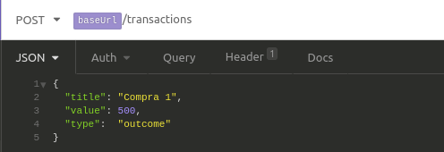
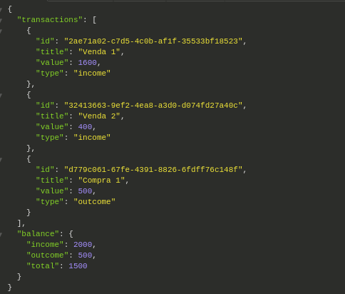

# NodeJS-RepositoryPattern
## Repository

O Repository é um conceito introduzido no Data Mapper Pattern ou Repository Pattern que consiste em uma ponte entre nossa aplicação e a fonte de dados, seja ela um banco de dados, um arquivo físico ou qualquer outro meio de persistência de dados da aplicação.

Essa implementação visa isolar a forma com que nos comunicamos com os dados, abstraindo lógicas comuns de operações no banco.

Geralmente o Repository possui os métodos comuns de comunicação com uma fonte de dados como listagem, busca, criação, edição, remoção, mas conforme a aplicação cresce o desenvolvedor tende a encontrar outras operações repetitíveis e, com isso, popula o repositório com mais funcionalidades.

## Service

O Service é um conceito introduzido no Service Pattern. Ele tem como objetivo abstrair regras de negócio das rotas, além de tornar nosso código mais reutilizável.

No contexto da nossa jornada, essa implementação visa reduzir a complexidade das rotas da nossa aplicação e deixá-las responsáveis apenas pelo que realmente devem fazer: receber uma requisição, repassar os dados da requisição a outro arquivo e devolver uma resposta.

O Service deve ter um nome descritivo (ex.: updateDeliveryManProfileService) e **sempre** possuir apenas **um** método (ex.: execute()). Além disso, caso outra rota ou arquivo precise executar essa  mesma ação, basta chamar e executar esse Service, obedecedo assim a outro importante princípio: DRY (Don't Repeat Yourself).

## Descrição

Nesta implementação do RepositoryPattern e ServicePattern, criei uma API Rest para controlar o fluxo de entrada e saida de dinheiro de uma conta, e o balanço final da conta.
  
Para executar uma transação de entrada ou saída, deve ser feito através da rota "host:3333/transactions" usando o método POST com o body:  

  
Para consultar as transações e fazer o balanço, é necessário utilizar a mesmo rota, porém utilizando o método GET:  

  

## Desenvolvimento

Utilizando o ServicePattern para controlar todas as regras de negócio das transações, utilizei as seguintes regras de negócio:
<ul>
  <li> Não pode retirar mais dinheiro do que se tem na conta</li>
  <li> As operações só podem ser de "income" e "outcome"</li>
</ul>

Utilizando o RepositoryPattern para controlar todas as transações, implementei as seguintes funcionalidades:
<ul>
  <li> Controle da lista de objetos Transaction </li>
  <li> Criação de objeto Transaction </li>
  <li> Criação de objeto Balanço </li>
</ul>

## Conclusão
Utilizando o ServicePattern, separei toda regra de negócio tanto da parte de rotas, quanto da parte que faz a "persistência"(neste caso não se faz), das transações.
  Já utilizando o RepositoryPattern, controlei toda criação de objetos Transaction, podendo facilmente implementar algum tipo de "persistência" sem envolver outras
 partes da aplicação.
